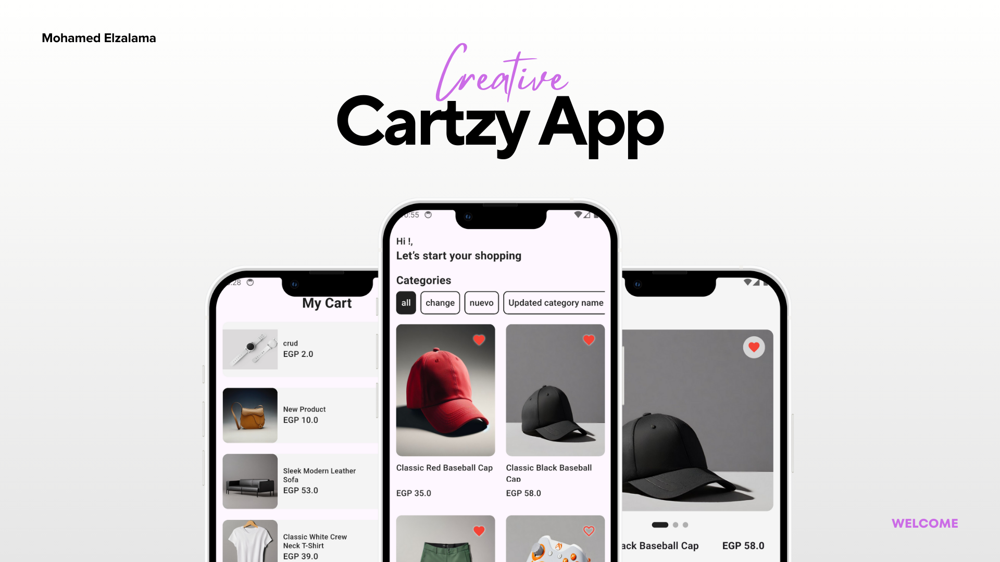
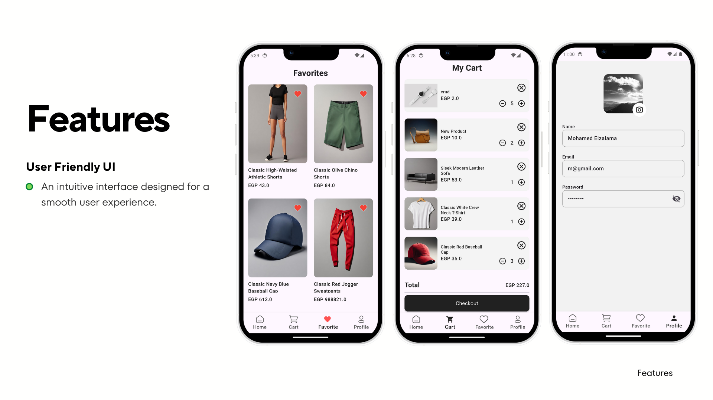
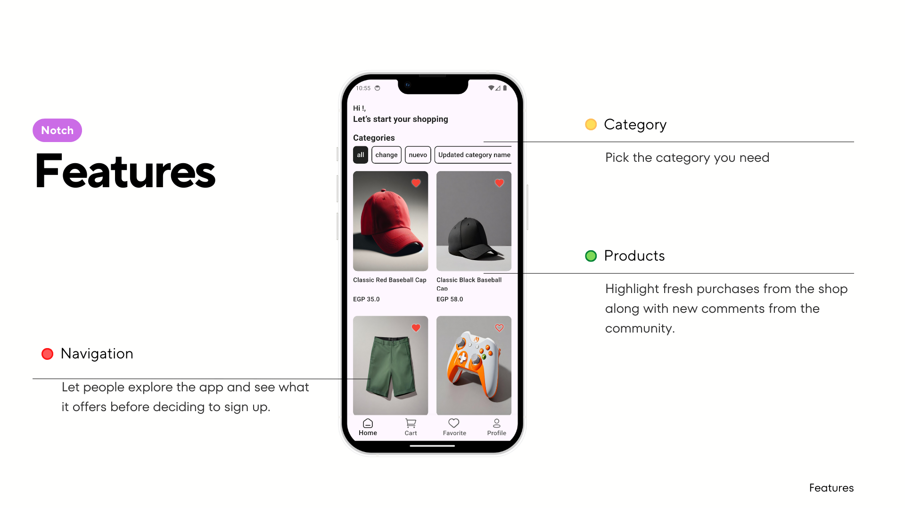
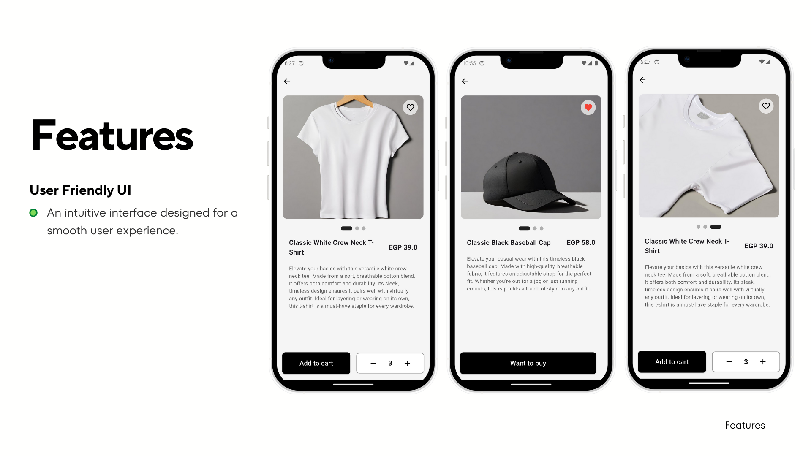
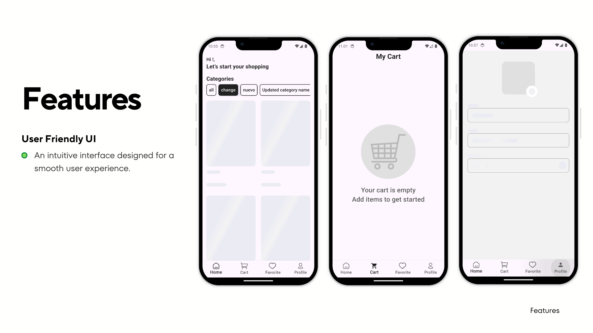

<!DOCTYPE html>
<html>
<body>
    <h1 align="center">Cartzy App</h1>
    

        • <a href="#key-features">Key Features</a>
        • <a href="#tech-stack">Tech Stack & Tools</a>
        • <a href="#how-it-works">How To Use</a>    
 

    
 
 
 
 
 
   
   
    
 <h2 id="key-features">📌 Key Features</h2>
   <ul>
        <li><strong>User-Friendly Interface:</strong> Clean, intuitive design with a soft pastel theme for a smooth and enjoyable shopping experience.</li>
        <li><strong>Product Browsing with Categories:</strong> Easily navigate through categorized products (e.g., All, Change, Nuevo) with visually appealing grids and heart icons for quick favoriting.</li>
        <li><strong>Favorites Section:</strong> Save and view your favorite items in a dedicated tab for quick access and future purchases.</li>
        <li><strong>Shopping Cart Management:</strong> Add/remove items, adjust quantities, view real-time totals, and proceed to checkout seamlessly.</li>
        <li><strong>Detailed Product Views:</strong> Access in-depth product pages with high-quality images, descriptions, pricing (in EGP), quantity selectors, and "Add to Cart" functionality.</li>
        <li><strong>Bottom Navigation Bar:</strong> Quick access to Home, Cart, Favorites, and Profile sections for effortless app exploration.</li>
        <li><strong>Guest-Friendly Navigation:</strong> Browse products and categories without requiring login, encouraging exploration before signing up.</li>
        <li><strong>Profile Management:</strong> Simple user profile view and edit screen with name, email, and password fields.</li>
        <li><strong>Empty State Handling:</strong> Helpful prompts (e.g., "Your cart is empty – Add items to get started") to guide users.</li>
    </ul>
    
<h2 id="tech-stack">🛠 Tech Stack & Tools</h2>
   <ul>
        <li><strong>Development:</strong> Likely built with modern mobile frameworks (Flutter)</li>
        <li><strong>UI Design:</strong> Custom components  rounded cards, and consistent iconography</li>
        <li><strong>State Management:</strong> Efficient handling of cart, favorites, and user data by Bloc State Management</li>
        <li><strong>Image Handling:</strong> High-quality product images with optimized loading and placeholder support</li>
        <li><strong>Navigation:</strong> Bottom tab navigation with clear icons and labels</li>
    </ul>
    
<h2 id="how-it-works">🛠 How It Works</h2>
    <ol>
        <li><strong>Launch the App:</strong> Opens to a welcoming home screen with a personalized greeting and category filters.</li>
        <li><strong>Browse Products:</strong> Scroll through categorized product grids, view images, prices, and tap hearts to add to favorites instantly.</li>
        <li><strong>View Product Details:</strong> Tap any item to see enlarged images, detailed descriptions, pricing, and options to add to cart with quantity selection.</li>
        <li><strong>Manage Favorites:</strong> Access the Favorites tab to review saved items in a clean grid layout.</li>
        <li><strong>Add to Cart:</strong> From product pages or directly from listings, add items with adjustable quantities; cart updates in real-time.</li>
        <li><strong>Profile Access:</strong> View and edit personal information via the Profile tab.</li>
    </ol>
    
    
    
</body>
</html>
